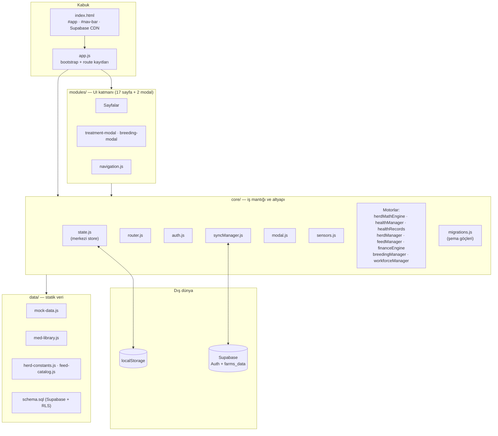
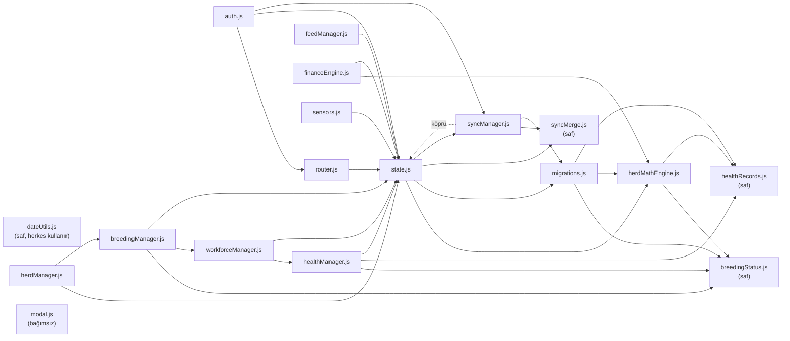
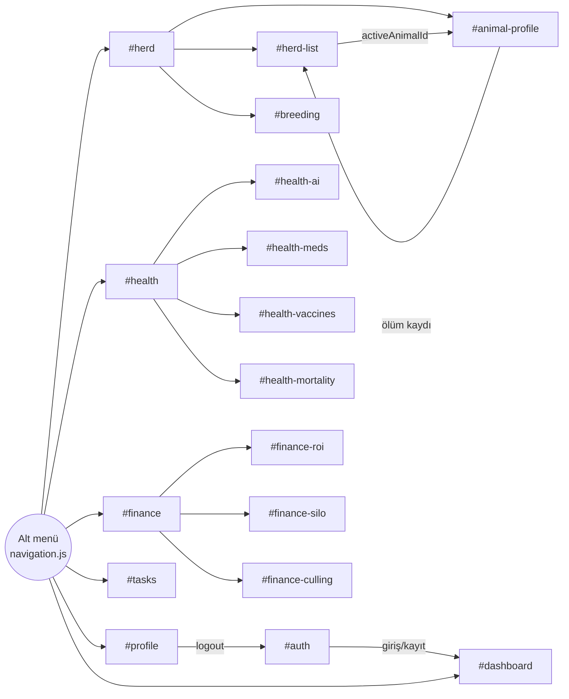
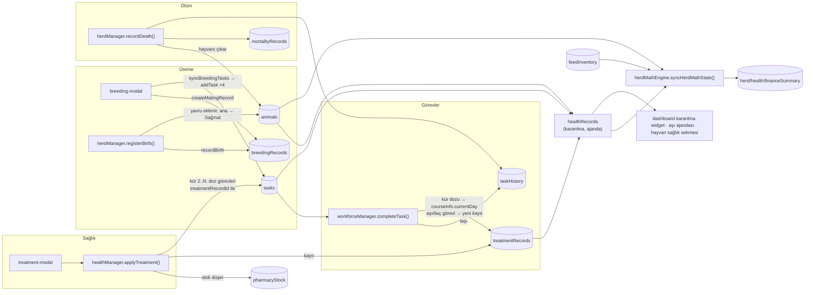
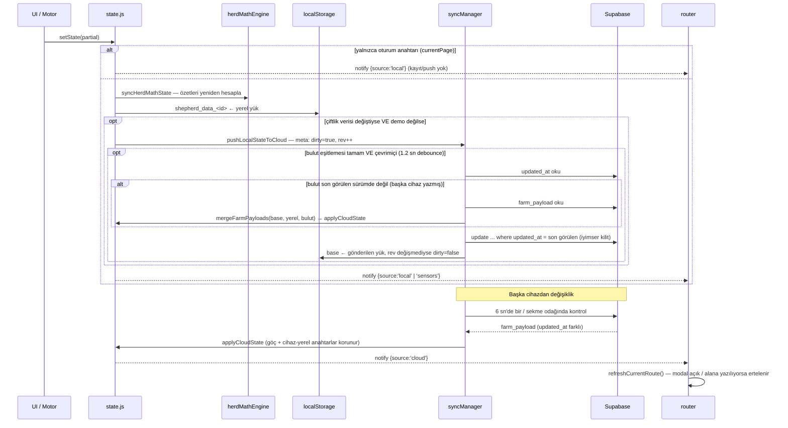
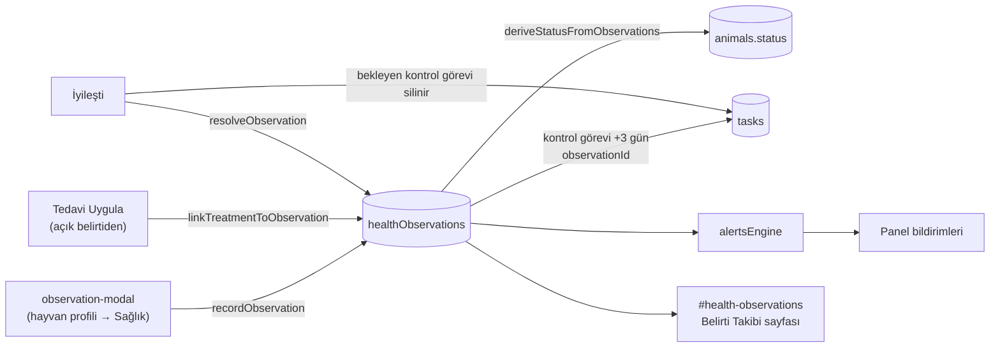

# ShepherdAI — Mimari Haritası

> Kod tabanının incelenmesiyle çıkarılmıştır (v0.06 + mimari düzeltmeler). `PROJECT_STATUS.md` hedeflenen mimariyi anlatır; bu belge **kodun gerçekte nasıl bağlandığını** gösterir.

## 1. Genel Bakış

| Özellik | Değer |
|---|---|
| Tür | Framework'süz, tek sayfa uygulaması (SPA) — Vanilla JS, ES Modules |
| Build | Yok (tarayıcı `app.js`'i doğrudan `type="module"` ile yükler) |
| Yönlendirme | Hash tabanlı (`#dashboard`, `#herd-list` …) |
| Kalıcılık | `localStorage` (birincil) + Supabase `farms_data` tablosu (bulut kopyası) |
| Harici bağımlılık | Yalnızca `@supabase/supabase-js@2` (CDN, global `window.supabase`) |
| Kimlik doğrulama | Supabase Auth (e-posta + şifre); demo hesabı yalnızca yerel |
| Kod hacmi | ~11.900 satır (≈4.150 core, ≈5.150 UI, ≈2.350 CSS) |

## 2. Katmanlar



## 3. Modül Bağımlılık Grafiği

### 3.1 Core içi bağımlılıklar



Saf modüller state'e bağımlı değildir; hem her `setState`'te çalışan `herdMathEngine` hem de UI'a hizmet eden motorlar aynı kuralı kullanır:
- `healthRecords.js` — arınma hesabı, karantina listesi, aşı ajandası
- `breedingStatus.js` — anaç bazında gebelik durumu, gebe hayvan listesi
- `syncMerge.js` — üç yönlü kayıt bazında birleştirme
- `observationRecords.js` — belirtiden hayvan durumu türetme, salgın şüphesi, ihbarı zorunlu belirti birlikteliği, uzun süre açık kalan belirtiler
- `sanitize.js` — HTML kaçışlama (`escapeHtml`), serbest metin temizleme (`stripTags`), küpe no karakter kuralı (`isValidTag`)
- `dateUtils.js` — yerel saat dilimine göre takvim tarihi (`todayIso`, `addDaysIso`, `daysBetweenIso`). `toISOString()` UTC verdiği için gün hesabında kullanılmaz.

**Döngüsel bağımlılık yok.** İki eski döngü bağımlılık ters çevrilerek kırıldı:
- `syncManager` artık `state`'i import etmiyor; `state.js` yüklenirken `connectStateBridge()` ile kendi fonksiyonlarını kaydediyor.
- `router` artık `auth`'u import etmiyor; oturum kontrolü `app.js`'ten `initRouter({ isAuthenticated })` ile veriliyor.

### 3.2 UI → Core bağlantıları

| UI modülü | state | auth | router | modal | health | herdMgr | feed | breeding | finance | workforce | diğer |
|---|:-:|:-:|:-:|:-:|:-:|:-:|:-:|:-:|:-:|:-:|---|
| `auth.js` (giriş ekranı) | | ● | ● | ● | | | | | | | |
| `dashboard.js` | ● | ● | | | ● | | | | | | |
| `herd.js` (menü) | | | ● | | | | | | | | |
| `herd-list.js` | ● | | ● | ● | ● | ● | | | | | herd-constants |
| `animal-profile.js` | ● | | ● | ● | ● | ● | | ● | ● | ● | healthRecords, `animalData` (mock), iki modal |
| `breeding.js` | ● | | | ● | | | | ● | | | breeding-modal |
| `breeding-modal.js` | ● | | | | | | | ● | | ● | |
| `health.js` (menü) | | | ● | | | | | | | | |
| `health-meds.js` | ● | | | ● | ● | | | | | | med-library, treatment-modal |
| `health-ai.js` | ● | | | ● | ● | | | | | | |
| `health-vaccines.js` | | | | | ● | | | | | | |
| `health-mortality.js` | ● | | | ● | | ● | | | | | herd-constants |
| `treatment-modal.js` | ● | | | ● | ● | | | | | | med-library |
| `finance.js` (menü) | | | ● | | | | | | | | |
| `finance-roi.js` | ● | | | ● | | | | | ● | | |
| `finance-silo.js` | ● | | | ● | | | ● | | ● | | feed-catalog |
| `finance-culling.js` | | | | | | | | | ● | | |
| `tasks.js` | ● | | | ● | | | | | | ● | |
| `profile.js` | ● | ● | | ● | | | | | | | |
| `navigation.js` | | | ● | | | | | | | | syncManager (durum rozeti) |

`animal-profile.js` hâlâ uygulamanın **merkez düğümü**dür ama artık state'e doğrudan yazmaz; tüm mutasyonlar `herdManager` / `healthManager` / `workforceManager` üzerinden geçer.

### 3.3 Sayfa akışı (navigasyon)



Router koruması: oturum yoksa her rota `#auth`'a, oturum varken `#auth` → `#dashboard`'a yönlenir. Her rota `{ render(): HTMLElement, init?() }` sözleşmesine uyar; router `#app`'i boşaltıp yeni elemanı ekler.

## 4. Veri Katmanı: AppState

### 4.1 State şeması (`core/state.js` → `EMPTY_STATE_TEMPLATE`, şema v4)

```
AppState
├── schemaVersion: 4                      ← core/migrations.js
├── Oturum anahtarları (hiçbir yere yazılmaz)
│   └── currentPage, currentUser, currentTenantKey
├── Cihaz-yerel anahtarlar (localStorage'a yazılır, buluta GİTMEZ, buluttan EZİLMEZ)
│   └── activeAnimalId, userRole, sensors
├── Çiftlik verisi (localStorage + bulut)
│   ├── focusMode
│   ├── animals[]            ← status = yalnızca klinik durum ('good'|'warning'|'danger')
│   ├── treatmentRecords[]   ← TEK sağlık kaynağı: ilaç + aşı (recordType: 'treatment'|'vaccine')
│   ├── pharmacyStock[], customMedications[]
│   ├── tasks[], taskHistory[]   ← bekleyen aşılar = tasks (type: 'vaccine')
│   ├── breedingRecords[]
│   ├── healthObservations[] ← belirti kayıtları (tarih, belirtiler, şiddet, ateş, not, açık/iyileşti, bağlı tedaviler)
│   ├── feedInventory[], feedHistory[]
│   ├── mortalityRecords[]
│   └── alerts[]             ← kullanılmıyor; bildirimler core/alertsEngine.js ile kayıtlı veriden üretilir
└── Türetilmiş özetler (her setState'te yeniden hesaplanır, buluta gitmez)
    ├── herdSummary      ← calculateHerdSummaryStats(animals)
    ├── healthSummary    ← calculateHealthSummaryStats(animals, treatmentRecords, tasks)
    └── financeSummary   ← calculateHerdFeedMetrics(animals, feedInventory)
```

Eski `vaccines[]` listesi kaldırıldı. Eski formatta gelen veri (localStorage, bulut veya demo tohumu) `migrateTenantData()` ile otomatik dönüştürülür: yapılmış aşılar → `treatmentRecords`, bekleyenler → `tasks`, `applyTreatment`'ın ürettiği kopyalar atlanır. Göç idempotenttir.

### 4.2 Kim neyi yazıyor? (yazma sahipliği)

| State alanı | Yazan core fonksiyonları |
|---|---|
| `animals` | `herdManager` (`addAnimal`, `updateAnimal`, `registerBirth`, `recordDeath`), `healthManager.applyTreatment` (`lastVaccine`) |
| `treatmentRecords` | `healthManager.applyTreatment`, `workforceManager.completeTask` (aşı/ilaç görevi → kayıt, kür dozu → ilerleme) |
| `pharmacyStock` | `healthManager` (`deductFromStock`, `addPharmacyStock`, `markStockAsWaste`) |
| `customMedications` | `healthManager.addCustomMedication` |
| `tasks` | `workforceManager.addTask/completeTask`, `healthManager.applyTreatment` (kür dozları), `breeding-modal` → `addTask(syncBreedingTasks())` |
| `taskHistory` | `workforceManager.completeTask`, `herdManager.recordDeath` |
| `breedingRecords` | `breeding-modal`, `herdManager.registerBirth` |
| `feedInventory/feedHistory` | `feedManager` (`addFeedStock`, `deductDailyHerdFeed`, `deductFeed`, `applyRation`) |
| `mortalityRecords` | `herdManager.recordDeath` |
| `sensors` | `sensors.js` (60 sn'de bir) |
| `focusMode` / `userRole` / `activeAnimalId` / `currentPage` | `dashboard` / `profile` / `herd-list` + `herdManager` / `router` |

### 4.3 Çapraz (cross-module) veri akışları



## 5. Yaşam Döngüsü, Reaktiflik ve Senkronizasyon

### 5.1 Açılış sırası (`app.js → initApp`)

1. `initSyncManager()` — online/offline/focus/visibility dinleyicileri + **6 sn'de bir** bulut kontrolü (`checkForCloudUpdates`).
2. Oturum varsa `loadTenantState(user)` — localStorage'dan yükle → göç → (demo değilse) arka planda buluttan çek.
3. 17 rota kaydı → `renderNavBar()` → `initRouter()` (router state'e abone olur).
4. `startSensorPolling(60000)`.
5. `verifySession()` — çevrimiçiyken Supabase oturumu yoksa ya da eski sürüm oturumuysa çıkış yapılır.

### 5.2 `setState()` ve bildirim kaynakları



**Senkron güvenceleri** (`core/syncManager.js`):
- Her yerel değişiklik kiracının meta kaydını (`shepherd_sync_meta_<kiracı>`) kirli işaretler. Kirli veri buluta yazılana kadar buluttan **ezilmez**; uygulama kapatılıp açılsa bile.
- Açılışta (`syncOnLoad`):
  - Kirli veri yoksa bulut verisi alınır.
  - Bulut değişmemişse yerel veri gönderilir.
  - İkisi de değişmişse kayıt bazında birleştirilir.
- Bulut okuması başarısız olursa push yapılmaz (bayat cihaz bulutu ezemez). Okuma bağlantı geldiğinde, sekme odağında ve 6 sn'lik yoklamada yeniden denenir.
- İki cihaz aynı anda yazarsa, güncelleme yalnızca son görülen `updated_at` üzerine yapılır; çakışmada önce birleştirilir.
- Birleştirme kayıt bazındadır (`syncMerge.js`):
  - Yalnızca bir tarafta değişen kayıt o tarafın sürümünü alır.
  - İki tarafta da değişen kayıtta yerel kazanır.
  - Silmeler yayılır, yeni kayıtların hepsi korunur.

Bildirimler `{ source, keys }` meta bilgisi taşır: `local`, `cloud`, `load`, `sensors`, `reset`. Router yalnızca `cloud` kaynağında açık sayfayı yeniden çizer (scroll konumu korunur); yerel işlemlerde sayfalar kendi yeniden çizimlerini yapar. Kendi yaptığımız push'un `updated_at` değeri sunucudan okunur, böylece kendi yazdığımız veri "başka cihazdan güncelleme" sanılmaz; gönderilmeyi bekleyen yerel değişiklik varken bulut verisi uygulanmaz.

### 5.3 Kimlik doğrulama ve bulut güvenlik modeli

| Katman | Davranış |
|---|---|
| Hesaplar | Supabase Auth (`signInWithPassword`, `signUp`). Şifreler yalnızca Supabase'de bcrypt hash olarak tutulur. İstemcide şifre saklanmaz. |
| Oturum | supabase-js token'ı kendi yönetir. Uygulama profili (şifresiz) `shepherd_current_user` anahtarında tutulur, böylece uygulama çevrimdışı da açılır. |
| Kiracı anahtarı | `shepherd_data_<auth.uid()>`. |
| Veritabanı | `farms_data(tenant_key, owner_id, farm_payload, updated_at)`. RLS: kullanıcı yalnızca `owner_id = auth.uid()` satırını okuyup yazar, `tenant_key` biçimi zorlanır. Anon rol hiçbir satıra erişemez. |
| Demo | `loginAsDemo()` ile şifresiz açılır, veri yalnızca bu cihazda tutulur, buluta hiç istek atılmaz (durum rozeti: 💾 Yalnızca Bu Cihaz). |
| Eski hesaplar | `schema.sql` eski kullanıcı listesini istemcinin erişemediği `legacy_users` tablosuna bcrypt hash olarak taşır ve düz metin satırını siler. Kullanıcı aynı e-postayla giriş/kayıt olduğunda `claim_legacy_farm(eski_şifre)` eski çiftlik satırını yeni hesaba bağlar. Yeni hesapta zaten veri varsa eski satır silinmez, yükü döndürülür ve kayıt bazında birleştirilir. Bu işlem profil sayfasındaki "Eski Hesap Verisini Aktar" ile sonradan da yapılabilir. Bu cihazda eski kayıt varsa giriş sırasında hesap otomatik oluşturulur ve yerel veri yeni anahtara kopyalanır. |

| localStorage anahtarı | İçerik |
|---|---|
| `shepherd_current_user` | Aktif kullanıcı profili (şifresiz) |
| `shepherd_data_<uid>` / `shepherd_data_demo` | Kiracının çiftlik state'i |
| `shepherd_sync_meta_<kiracı>` | `{ dirty, rev, cloudUpdatedAt }`: gönderilmemiş değişiklik takibi |
| `shepherd_sync_base_<kiracı>` | Bulutla en son eşitlenen yük (üç yönlü birleştirmenin ortak tabanı) |
| `shepherd_pending_sync_queue` | *Eski sürüm.* Varsa kirli veri olarak devralınır ve silinir. |
| `sb-<proje>-auth-token` | Supabase oturum token'ı (supabase-js yönetir) |
| `shepherd_users_registry` | *Eski sürüm.* Yalnızca göç için okunur, göç tamamlanınca silinir. |

## 6. Motorların Sorumlulukları

| Motor | Ana fonksiyonlar | Not |
|---|---|---|
| `healthRecords` | Arınma hesabı, hayvan bazlı arınma durumu, karantina listesi, aşı ajandası, kür doz tarihi | Saf; state'e bağımlı değil. |
| `healthManager` | İlaç kütüphanesi birleştirme, dozaj, gebelik riski, stok (FIFO düşüş), `applyTreatment`, görevden kayıt üretme, semptom değerlendirme | En büyük sağlık motoru. |
| `herdManager` | `addAnimal` (küpe tekilliği), `updateAnimal`, `registerBirth`, `recordDeath`, kayıp tahmini | Önceden UI'da dağınık olan sürü yaşam döngüsü. |
| `feedManager` | Yem girişi (ağırlıklı ortalama fiyat), günlük sürü yemlemesi, manuel çıkış, rasyon | Önceden `finance-silo.js` içindeydi. |
| `herdMathEngine` | `syncHerdMathState`, yem DMI hesabı, `parseDate` (TR tarih ayrıştırma) | Her `setState`'te çalışır. |
| `breedingManager` | Gebelik kilometre taşları, akrabalık riski, eşleştirme kaydı, görev üretimi, doğum kaydı, uyum skoru | Saf fonksiyonlar. |
| `workforceManager` | Görev CRUD, tarih filtreleme/sıralama, tamamlama → geçmiş + sağlık kaydı | `completeTask` → `treatmentRecords`. |
| `financeEngine` | Hayvan/sürü ROI, silo tükenme, ayıklama listesi | Sabit/mock değerler ve `Math.random()` sparkline. |
| `migrations` | `migrateTenantData` (v1 → v2) | Yükleme ve bulut uygulamasında çalışır. |
| `sensors` | Demo'da sabit telemetri, diğerlerinde "bağlantı yok" | `connectWebSocket` boş iskelet. |
| `modal` | `showAlert/Confirm/Prompt/FormModal/Select` (Promise tabanlı) | Bağımsız. |

## 7. Mimari Gözlemler

### Çözülenler (1. tur: mimari)

1. ~~Reaktiflik yok~~ → Router state'e abone; bulut güncellemesi açık sayfayı yeniden çiziyor (modal/form kullanımında erteleniyor).
2. ~~İki paralel sağlık kaydı / iki karantina tanımı~~ → `treatmentRecords` tek kaynak.
3. ~~İş mantığı UI'a sızmış~~ → `herdManager`, `feedManager`, `breedingManager.saveMatingRecord`.
4. ~~Güvenlik açığı~~ → Supabase Auth + sahiplik bazlı RLS.

### Çözülenler (2. tur: mantıksal hatalar)

| # | Hata | Çözüm |
|---|---|---|
| 1 | Çevrimdışı değişiklik açılışta buluttan eziliyordu | Kirli veri takibi + açılışta birleştirme |
| 2 | Bulut okuması başarısızsa bayat cihaz bulutu eziyordu | Okuma başarılı olana kadar push yok, otomatik yeniden deneme |
| 3 | Eşleşme hiçbir zaman "gebe" olmuyordu, ilaçta gebelik uyarısı yoktu | Anaç bazlı durum (`breedingStatus.js`), "Gebelik Doğrulandı / Tutmadı" adımları. Doğrulanmamış katımda "olası gebe" uyarısı veriliyor. |
| 4 | Kür dozları stoktan düşmüyordu, doz gün sayısına bölünüyordu | Her doz tam doz; doz görevi tamamlanınca stoktan düşülüyor (stok yetmezse görev tamamlanmıyor) |
| 5 | Ebeveyni bilinmeyenler "kardeş" çıkıyordu | Bilinmeyen ebeveyn `null` (v3 göçü) |
| 6 | Grup katımında bir doğum tüm grubu kapatıyordu | Yalnızca o anacın durumu kapanıyor; ikiz/üçüz destekleniyor |
| 7 | Erkek hayvan anaç olarak eşleşebiliyordu | Erkek profili koç olarak katım açıyor; cinsiyet ve açık katım doğrulaması core'da |
| 8 | Açık şişe raf ömrü izlenmiyordu | İlk kullanımda açılış tarihi işleniyor, önce açık şişe kullanılıyor, süresi dolan kullanılmıyor |
| 9 | Boş arınma süresi 0 gün kaydediliyordu | Arınma ve dozaj zorunlu |
| 10 | Geçmişte "null" doz | Doz yoksa gösterilmiyor |
| 11 | Ölen hayvanın görevleri kalıyordu | Bireysel görevler iptal ediliyor, açık katımı LOST olarak kapanıyor |
| 12 | Serbest metin vade tarihi | Tarih seçici ve normalizasyon |
| 13 | 00:00–03:00 arası "bugün" bir gün önceydi | `dateUtils.js` (yerel takvim) |
| — | Bireysel görevler hep TR-102'ye atanıyordu | Görüntülenen hayvana atanıyor |
| — | Sahte göstergeler (karkas %48.5, ikizlik %34, hayvan başı 180 ₺ gelir, rastgele ROI grafiği) | KPI'lar kayıtlı veriden hesaplanıyor, hesaplanamayan "Veri yok". ROI'deki varsayımlar `data/finance-assumptions.js`'te ve ekranda listeleniyor. Yem maliyeti depodaki gerçek fiyatlardan. |
| — | Ayıklama listesi "undefined" gösteriyordu | Doğumdan bu yana günlük artış ve yem maliyetinden hesaplanıyor |
| — | İki cihazdan eşzamanlı düzenlemede veri kaybı | Kayıt bazında birleştirme + iyimser kilit |
| — | Stok formunda SKT boşsa 2027-12-31 uyduruluyordu, birim karışıklığı | SKT zorunlu, birim ilacın doz birimi |

### Çözülenler (3. tur: kalan mimari konular)

**Performans.** Ölçümler 1500 hayvan ve 1500 tedavi kaydıyla yapıldı.

| İşlem | Önce | Sonra |
|---|---|---|
| Tek değişiklik (`setState` + kayıt) | 60 ms | 21 ms |
| Sürü listesi çizimi | 174 ms | 25 ms |
| Dashboard çizimi | 105 ms | 20 ms |
| Karantina listesi | 51 ms | 7 ms |

- Karantina hesabı tedavi kayıtlarını tek geçişte, hayvan bazında gruplayarak yapıyor (önceden her hayvan için tüm kayıtlar taranıyordu).
- Salt okuma yapan core fonksiyonları `readState()` ile kopyasız okuyor. UI ve yazma yapan kod `getState()` derin kopyasını kullanmaya devam ediyor.
- Abonelere her bildirimde derin kopya gönderilmiyor; abone gerekirse kendisi `getState()` çağırıyor.
- Aynı işlem içindeki ardışık `setState` çağrıları tek bir localStorage yazımında birleşiyor (mikro-görev). Yazım, tarayıcı bir sonraki olaya geçmeden tamamlanıyor.

**Döngüsel importlar.** Kaldırıldı (bkz. 3.1).

**Demo verisi sızıntısı.** Hayvan profili eksik alanları artık demo verisiyle doldurmuyor; eksik alan "—" ya da "Bilinmiyor" görünüyor.
- Yaşı bilinmeyen hayvanda "NaNY NaNA" yerine "Bilinmiyor" yazıyor.
- `mock-data.js` yalnızca demo tohum verisini içeriyor; kullanılmayan 7 sahte veri kaldırıldı.

### Çözülenler (4. tur: genel hata taraması)

| Hata | Çözüm |
|---|---|
| Aynı hesap iki sekmede açıkken bir sekmenin değişikliği diğerininkini siliyordu | `storage` olayıyla sekmeler arası bellek eşitleme; başka sekmede çıkış/giriş olursa sayfa yenilenir |
| Lakap/not gibi alanlara yazılan HTML çalışıyordu (XSS), tırnak işareti formları bozuyordu | Girişte `<` `>` temizleme + küpe no karakter kuralı, modal bileşeninde tam kaçışlama, v4 göçü ile eski veri temizliği |
| "Akıllı Asistan" gerçek hesaplarda sorun olsa da hep "Her şey yolunda" diyordu, demoda sabit sahte bildirimler vardı | `alertsEngine.js`: hasta hayvan, gecikmiş görev, gecikmiş doğum, kritik/süresi dolmuş ilaç, yem stoğu, yaklaşan doğum, arınma, sensör eşikleri |
| Zil simgesindeki kırmızı nokta hep yanıyordu | Yalnızca bildirim varken görünür |
| Girişte sensör paneli 60 sn "bağlantı yok" gösteriyordu | Oturum yüklenince sensör durumu hemen güncellenir |
| Günlük sürü yemlemesi aynı gün iki kez düşülebiliyordu | Aynı gün ikinci düşüşte onay istenir |
| Türkçe büyük harfli lakap/küpe aramada bulunamıyordu (`İnci` → `inci`) | `toLocaleLowerCase('tr-TR')` |
| Profilde "tarama hızı 5 sn olarak ayarlandı" deniyor ama hiçbir şey değişmiyordu | Gerçek durum bildiriliyor (ESP32 bağlantısı yok) |
| RFID tarama (simülasyon) düğmesi küpe alanı olmayan formlarda da çıkıyordu | Yalnızca küpe no alanı olan formlarda |

### Bilinen sınırlamalar / henüz yapılmamış özellikler

- **Hayvan satışı kaydı yok.** Hayvan profili ve ROI'deki "Hızlı Satış" yalnızca bilgi mesajı gösteriyor; hayvan sürüden çıkmıyor, satış geliri kaydedilmiyor.
- **Henüz çalışmayan düğmeler.** "AI Bireysel Teşhis" (profil) ve "Pasaportu Paylaş" yalnızca bilgi mesajı gösteriyor. Yapay zeka teşhis sayfası kural tabanlı ve sonucu kaydedilmiyor; ayrıca ele alınacak.
- **Rol yetkisi yok.** "Sahip / Çoban" seçimi yalnızca görünümü değiştiriyor; aynı hesapla herkes her işlemi yapabiliyor.
- **Senkron yükü büyüyor.** Çiftlik verisi bulutta tek JSON satırı olarak tutuluyor ve her değişiklikte tamamı gönderiliyor. Örneğin 1500 hayvanda bu yaklaşık 0.5 MB eder. Yem geçmişi gibi listeler zamanla büyüdükçe bu boyut da artar.

## 8. Belirti Kaydı ve Sağlık Takibi



| Kural | Değer (`data/symptom-catalog.js`) |
|---|---|
| Hayvan durumu | Açık belirtilerin en yüksek şiddeti: Ağır → Hasta, Orta → Riskli, Hafif → değişmez. İyileşti ile kapanınca yeniden hesaplanır. |
| Ateş | ≥ 40.0 °C en az Orta, ≥ 41.0 °C Ağır, < 37.5 °C en az Orta. Geçerli aralık 35–43 °C. |
| Kontrol görevi | Kayıttan 3 gün sonra ("Kontrol: <küpe> belirtileri"). |
| Uzun süre açık | 3 günden uzun açık kalan belirti → uyarı (yalnızca sürüdeki hayvanlar). |
| Salgın şüphesi | Son 7 günde aynı sistemde (solunum, sindirim, …) belirti gösteren ≥ 3 farklı hayvan → tehlike uyarısı. Ölen hayvanların kayıtları da sayılır. |
| İhbarı zorunlu | Ağızda yara + topallık aynı hayvanda → "Şap şüphesi" (tek hayvanda bile). |

