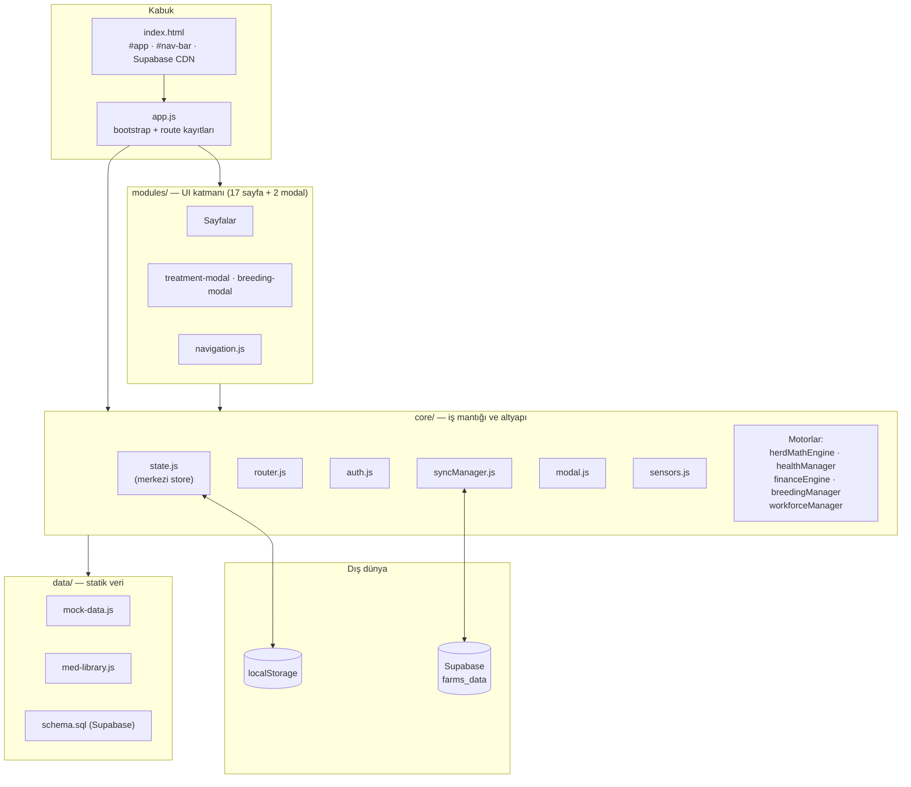
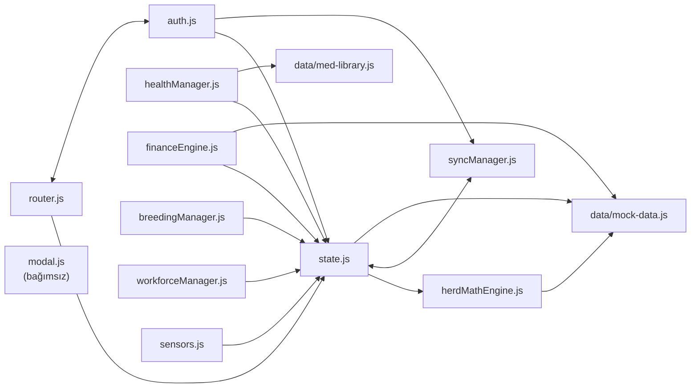
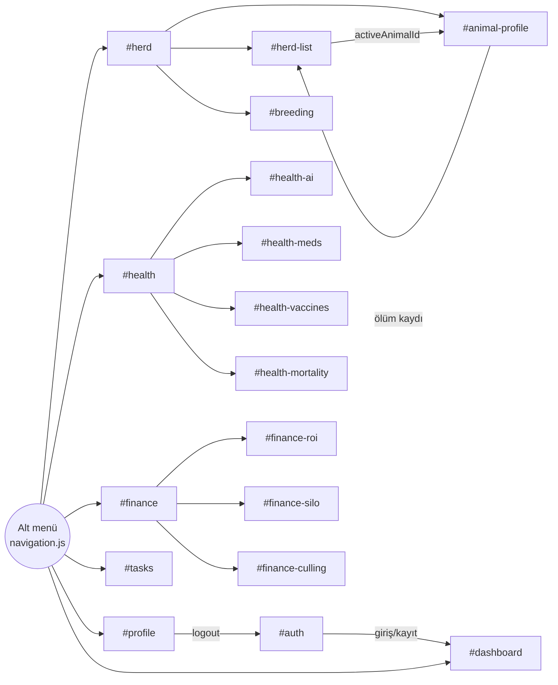
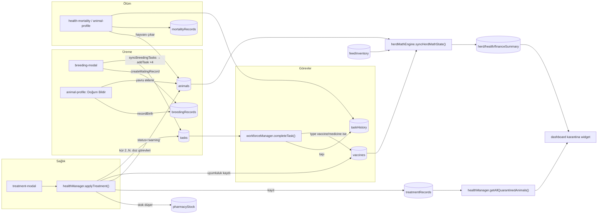
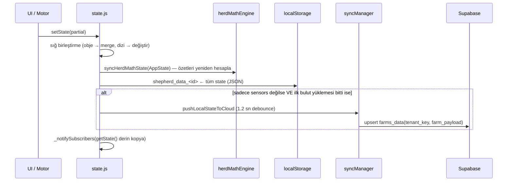

# ShepherdAI — Mimari Haritası

> Kod tabanının mevcut hâlinin (v0.06) incelenmesiyle çıkarılmıştır. `PROJECT_STATUS.md` hedeflenen mimariyi anlatır; bu belge **kodun gerçekte nasıl bağlandığını** gösterir.

## 1. Genel Bakış

| Özellik | Değer |
|---|---|
| Tür | Framework'süz, tek sayfa uygulaması (SPA) — Vanilla JS, ES Modules |
| Build | Yok (tarayıcı `app.js`'i doğrudan `type="module"` ile yükler) |
| Yönlendirme | Hash tabanlı (`#dashboard`, `#herd-list` …) |
| Kalıcılık | `localStorage` (birincil) + Supabase `farms_data` tablosu (bulut kopyası) |
| Harici bağımlılık | Yalnızca `@supabase/supabase-js@2` (CDN, global `window.supabase`) |
| Kod hacmi | ~11.800 satır (≈3.300 core, ≈5.700 UI, ≈2.350 CSS) |

## 2. Katmanlar



## 3. Modül Bağımlılık Grafiği

### 3.1 Core içi bağımlılıklar



**Döngüsel bağımlılıklar** (ES modules'da çalışıyor ama kırılgan):
- `state.js ⇄ syncManager.js` (state push/pull çağırır; sync `getState`/`applyCloudState` çağırır)
- `router.js ⇄ auth.js` (router `isAuthenticated`, auth `navigateTo` kullanır)
- `auth.js → state.js`, `router.js → state.js` ve `state.js → syncManager.js → state.js`

### 3.2 UI → Core bağlantıları

| UI modülü | state | auth | router | modal | health | breeding | finance | workforce | herdMath | diğer |
|---|:-:|:-:|:-:|:-:|:-:|:-:|:-:|:-:|:-:|---|
| `auth.js` (giriş ekranı) | | ● | ● | ● | | | | | | |
| `dashboard.js` | ● | ● | | | ● | | | | | |
| `herd.js` (menü) | | | ● | | | | | | | |
| `herd-list.js` | ● | | ● | ● | ● | | | | | |
| `animal-profile.js` | ● | | ● | ● | ● | ● | ● | ● | ● | `animalData` (mock), iki modal |
| `breeding.js` | ● | | | ● | | ● | | | | breeding-modal |
| `breeding-modal.js` | ● | | | | | ● | | ● | | |
| `health.js` (menü) | | | ● | | | | | | | |
| `health-meds.js` | ● | | | ● | ● | | | | | med-library, treatment-modal |
| `health-ai.js` | ● | | | ● | ● | | | | | |
| `health-vaccines.js` | ● | | | | | | | | | |
| `health-mortality.js` | ● | | | ● | | | | | | |
| `treatment-modal.js` | ● | | | ● | ● | | | | | med-library |
| `finance.js` (menü) | | | ● | | | | | | | |
| `finance-roi.js` | ● | | | ● | | | ● | | | |
| `finance-silo.js` | ● | | | ● | | | ● | | | |
| `finance-culling.js` | | | | | | | ● | | | |
| `tasks.js` | ● | | | ● | | | | ● | | |
| `profile.js` | ● | ● | | ● | | | | | | |
| `navigation.js` | | | ● | | | | | | | syncManager (durum rozeti) |

`animal-profile.js` (1.204 satır) uygulamanın **merkez düğümü**: neredeyse tüm motorlara bağlı.

### 3.3 Sayfa akışı (navigasyon)



Router koruması: oturum yoksa her rota `#auth`'a, oturum varken `#auth` → `#dashboard`'a yönlenir. Her rota `{ render(): HTMLElement, init?() }` sözleşmesine uyar; router `#app`'i boşaltıp yeni elemanı ekler.

## 4. Veri Katmanı: AppState

### 4.1 State şeması (`core/state.js` → `EMPTY_STATE_TEMPLATE`)

```
AppState
├── Oturum / UI (buluta gönderilmez*)
│   ├── currentPage, currentUser, currentTenantKey
│   └── focusMode ('meat'|'milk'|'breed'), userRole ('owner'|'worker'), activeAnimalId
├── Ham veri (kullanıcı/motorların yazdığı)
│   ├── animals[]            ← sürünün çekirdeği; neredeyse her şey buna referans verir
│   ├── treatmentRecords[]   ← yeni tedavi sistemi (arınma süreleri burada)
│   ├── vaccines[]           ← ESKİ uyumluluk listesi (hâlâ okunuyor/yazılıyor)
│   ├── pharmacyStock[], customMedications[]
│   ├── tasks[], taskHistory[]
│   ├── breedingRecords[]
│   ├── feedInventory[], feedHistory[]
│   ├── mortalityRecords[]
│   ├── alerts[]             ← yalnızca demo verisinden gelir, yazan kod yok
│   └── sensors{}
└── Türetilmiş özetler (her setState'te yeniden hesaplanır)
    ├── herdSummary      ← herdMathEngine.calculateHerdSummaryStats(animals)
    ├── healthSummary    ← calculateHealthSummaryStats(animals, vaccines)
    └── financeSummary   ← calculateHerdFeedMetrics(animals, feedInventory)
```
\* `currentPage/currentUser/currentTenantKey` localStorage ve buluta yazılan payload'dan çıkarılır.

### 4.2 Kim neyi yazıyor? (yazma sahipliği)

| State alanı | Yazan modüller |
|---|---|
| `animals` | `healthManager.applyTreatment`, `animal-profile` (odak, VKS, ağırlık, doğum, ölüm), `herd-list` (yeni hayvan), `health-mortality` |
| `treatmentRecords` | `healthManager.applyTreatment` |
| `vaccines` | `healthManager.applyTreatment`, `workforceManager.completeTask` |
| `pharmacyStock` | `healthManager` (`deductFromStock`, `addPharmacyStock`, `markStockAsWaste`) |
| `customMedications` | `healthManager.addCustomMedication` |
| `tasks` | `workforceManager.addTask/completeTask`, `healthManager.applyTreatment` (kür dozları), `breeding-modal` → `addTask(syncBreedingTasks())` |
| `taskHistory` | `workforceManager.completeTask`, `animal-profile` & `health-mortality` (ölüm kaydı) |
| `breedingRecords` | `breeding-modal`, `animal-profile` (doğum → `recordBirth`) |
| `feedInventory/feedHistory` | `finance-silo` |
| `mortalityRecords` | `animal-profile`, `health-mortality` |
| `sensors` | `sensors.js` (60 sn'de bir) |
| `focusMode` / `userRole` / `activeAnimalId` / `currentPage` | `dashboard` / `profile` / `herd-list` / `router` |

### 4.3 Çapraz (cross-module) veri akışları

Sistemlerin birbirine bağlandığı asıl noktalar bunlar:



## 5. Yaşam Döngüsü ve Senkronizasyon

### 5.1 Açılış sırası (`app.js → initApp`)

1. `initSyncManager()` — online/offline/focus/visibility dinleyicileri + **6 sn'de bir** bulut kontrolü (`checkForCloudUpdates`).
2. `syncUsersFromCloud()` — kullanıcı listesini bulutla birleştirir (async, beklenmez).
3. Oturum varsa `loadTenantState(user)` — localStorage'dan yükle → arka planda buluttan çek.
4. 17 rota kaydı → `renderNavBar()` → `initRouter()`.
5. `startSensorPolling(60000)`.

### 5.2 `setState()` bir kez çağrıldığında olanlar



### 5.3 Multi-tenant ve bulut modeli

| localStorage anahtarı | İçerik |
|---|---|
| `shepherd_current_user` | Aktif kullanıcı objesi (oturum = bu anahtarın varlığı) |
| `shepherd_users_registry` | Tüm kullanıcılar (yerel) |
| `shepherd_data_<userId>` | Kiracının tüm çiftlik state'i (demo: `shepherd_data_demo`) |
| `shepherd_pending_sync_queue` | Çevrimdışıyken son bekleyen push (tek kayıt) |

Supabase'de **tek tablo** var: `farms_data(tenant_key UNIQUE, farm_payload JSONB, updated_at)`. Her satır bir kiracının **tüm state'inin tek JSON blob'u**. Ek olarak `tenant_key = 'shepherd_global_users_registry'` satırı tüm kullanıcı listesini tutar.

Çakışma stratejisi: **son yazan kazanır** (alan bazlı birleştirme yok). `isCloudLoadDone` kilidi, buluttan ilk çekme bitmeden bayat yerel verinin buluta yazılmasını engeller.

## 6. Motorların Sorumlulukları

| Motor | Ana fonksiyonlar | Not |
|---|---|---|
| `herdMathEngine` | `syncHerdMathState`, yem DMI hesabı, `parseDate` (TR tarih ayrıştırma) | Her `setState`'te çalışır. `calculateHerdMedicationStatus` hiçbir yerden çağrılmıyor. |
| `healthManager` | İlaç kütüphanesi birleştirme, dozaj, gebelik riski, stok (FIFO düşüş), arınma süresi, karantina listesi, `applyTreatment`, semptom değerlendirme (AI teşhis) | En büyük ve en çok bağlantılı motor (600 satır). |
| `breedingManager` | Gebelik kilometre taşları, akrabalık riski, eşleştirme kaydı, görev üretimi, doğum kaydı, uyum skoru | Saf fonksiyonlar; state'e kendisi yazmaz, UI yazar. |
| `workforceManager` | Görev CRUD, tarih filtreleme/sıralama, tamamlama → geçmiş, sensör acil durum kuralları | `completeTask` → `vaccines` çapraz yazımı. |
| `financeEngine` | Hayvan/sürü ROI, silo tükenme, ayıklama listesi | Sabit/mock değerler (alış 2800 ₺, veteriner 450 ₺, `marketPrices`) ve `Math.random()` sparkline. |
| `sensors` | Demo'da sabit telemetri, diğerlerinde "bağlantı yok" | `connectWebSocket` boş iskelet. |
| `modal` | `showAlert/Confirm/Prompt/FormModal/Select` (Promise tabanlı) | Diğer hiçbir modüle bağımlı değil. |

## 7. Mimari Gözlemler (harita çıkarırken fark edilenler)

Ayrıntılı eksik analizi sonraya bırakıldı; burada yalnızca **bağlantı yapısını etkileyen** noktalar listelenmiştir.

1. **Reaktiflik fiilen yok.** `subscribe()` mevcut ama hiçbir UI modülü abone olmuyor (`dashboard.js` import ediyor, kullanmıyor). Başka cihazdan gelen bulut güncellemesi (`applyCloudState`) state'i değiştiriyor ama açık sayfa yeniden çizilmiyor; sayfalar ya kendi `_rerender()`'larını çağırıyor ya da navigasyonla tazeleniyor.
2. **İki paralel sağlık kaydı:** `treatmentRecords` (yeni, arınma tarihleriyle) ve `vaccines` (eski). `applyTreatment` ikisine de yazıyor; `healthSummary` ve `health-vaccines` eskisini, karantina widget'ı yenisini okuyor → aynı soruya iki kaynak.
3. **İki karantina tanımı:** `healthSummary.quarantine` = `animals.status === 'warning'` sayısı; dashboard widget'ı = `treatmentRecords`'tan hesaplanan aktif arınma. `status` tedaviyle `warning`'e çekiliyor ama arınma bitince geri alan kod yok.
4. **İş mantığı UI'a sızmış:** ölüm kaydı mantığı hem `animal-profile.js` hem `health-mortality.js` içinde ayrı ayrı; doğum kaydı (yavru oluşturma) `animal-profile.js` içinde; yem stoğu işlemleri `finance-silo.js` içinde. `PROJECT_STATUS.md`'deki "hesaplama yalnızca core'da" kuralı bu noktalarda ihlal ediliyor.
5. **Her `setState` maliyetli:** özet yeniden hesaplama + tüm state'in JSON'a yazılması + `getState()` derin kopyası. Router her sayfa geçişinde `setState({currentPage})` çağırdığı için gezinme bile buluta push tetikliyor.
6. **Döngüsel importlar** (`state⇄sync`, `router⇄auth`) — şimdilik çalışıyor, ama modül başlatma sırası değişirse kırılabilir.
7. **Mock verisine kalıcı bağlar:** `financeEngine` ve `herdMathEngine` fiyatları `mock-data.marketPrices`'tan, `animal-profile` eksik alanları `mock-data.animalData`'dan dolduruyor.
8. **Görev tipi tutarsızlığı:** `applyTreatment` kür görevlerini `type: 'health'` ile oluşturuyor; `TASK_TYPES`'ta `health` yok (`medicine` var).
9. **⚠️ Güvenlik (kritik):** Kullanıcı listesi **düz metin şifrelerle** `shepherd_global_users_registry` satırında tutuluyor; `schema.sql`'deki RLS politikası anon anahtara tam okuma/yazma veriyor ve anahtar istemci kodunda. Yani anahtarı gören herkes tüm kullanıcıların şifrelerini ve tüm çiftlik verilerini okuyup değiştirebilir. Demo/admin girişi de kodda sabit (`admin/admin`). Eksikler ele alınırken ilk sıraya konmalı.
