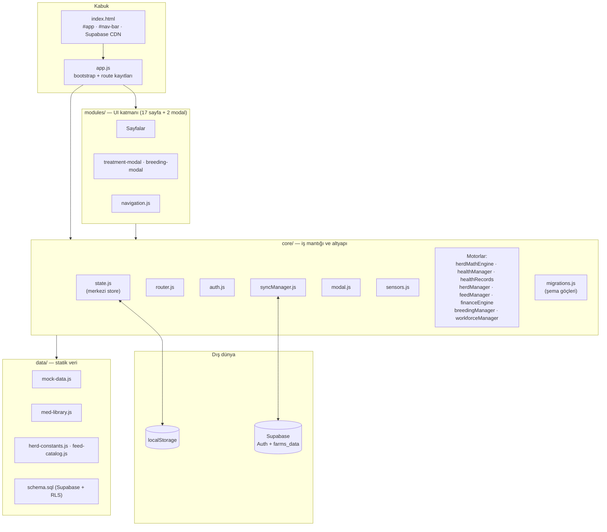
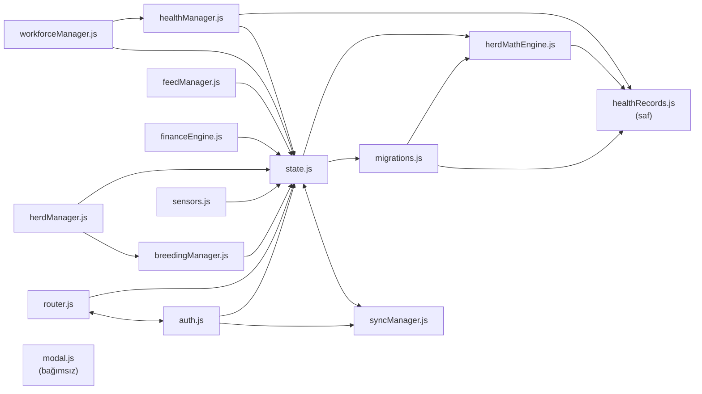
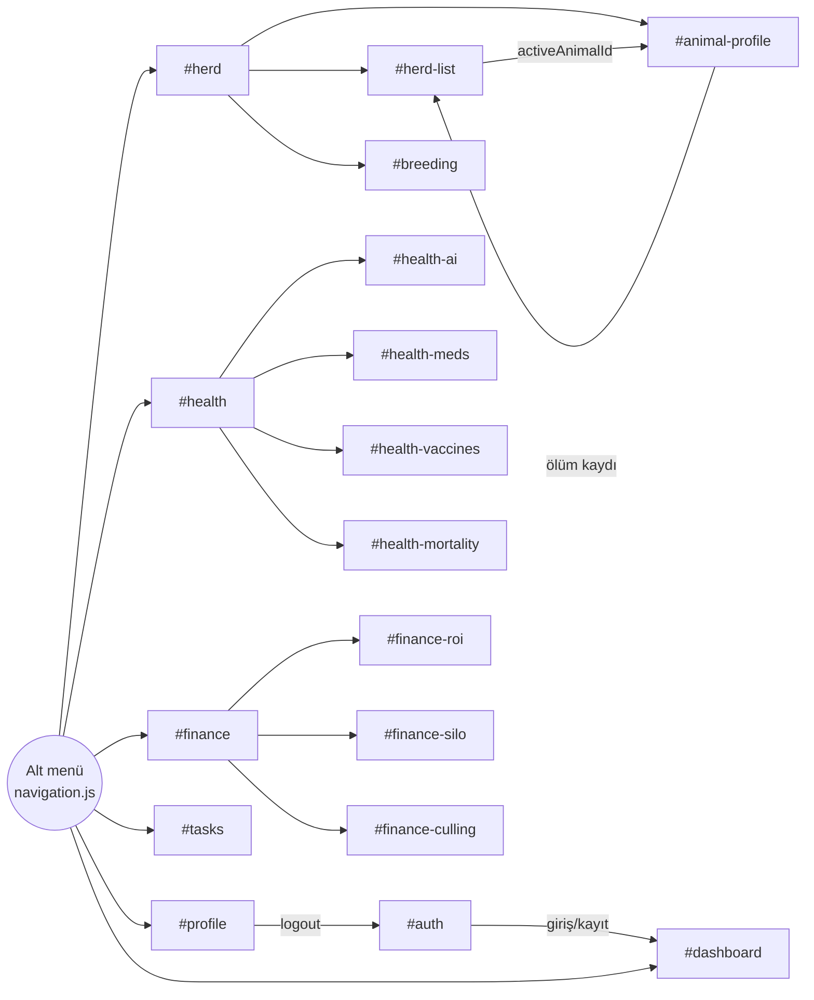
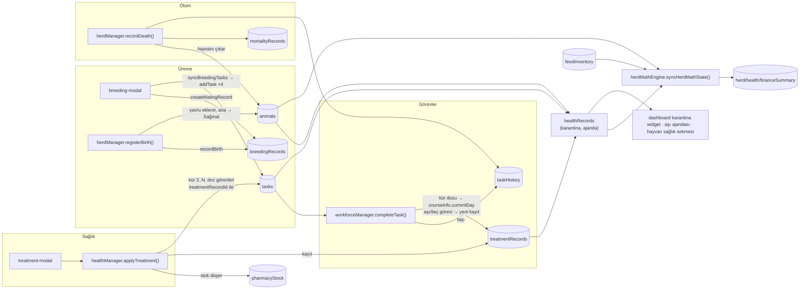
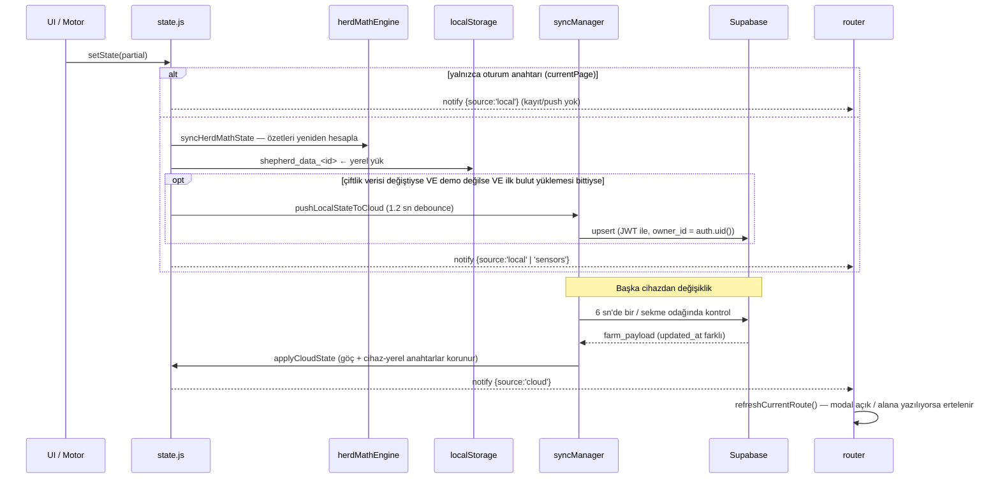

# ShepherdAI — Mimari Haritası

> Kod tabanının incelenmesiyle çıkarılmıştır (v0.06 + mimari düzeltmeler). `PROJECT_STATUS.md` hedeflenen mimariyi anlatır; bu belge **kodun gerçekte nasıl bağlandığını** gösterir.

## 1. Genel Bakış

| Özellik | Değer |
|---|---|
| Tür | Framework'süz, tek sayfa uygulaması (SPA) — Vanilla JS, ES Modules |
| Build | Yok (tarayıcı `app.js`'i doğrudan `type="module"` ile yükler) |
| Yönlendirme | Hash tabanlı (`#dashboard`, `#herd-list` …) |
| Kalıcılık | `localStorage` (birincil) + Supabase `farms_data` tablosu (bulut kopyası) |
| Harici bağımlılık | Yalnızca `@supabase/supabase-js@2` (CDN, global `window.supabase`) |
| Kimlik doğrulama | Supabase Auth (e-posta + şifre); demo hesabı yalnızca yerel |
| Kod hacmi | ~11.900 satır (≈4.150 core, ≈5.150 UI, ≈2.350 CSS) |

## 2. Katmanlar



## 3. Modül Bağımlılık Grafiği

### 3.1 Core içi bağımlılıklar



`healthRecords.js` state'e bağımlı olmayan saf fonksiyonlardır (arınma hesabı, karantina listesi, aşı ajandası). Böylece hem her `setState`'te çalışan `herdMathEngine` hem de UI'a hizmet eden `healthManager` aynı kuralı kullanır.

**Kalan döngüsel bağımlılıklar** (çalışıyor, ileride ele alınabilir): `state.js ⇄ syncManager.js`, `router.js ⇄ auth.js`.

### 3.2 UI → Core bağlantıları

| UI modülü | state | auth | router | modal | health | herdMgr | feed | breeding | finance | workforce | diğer |
|---|:-:|:-:|:-:|:-:|:-:|:-:|:-:|:-:|:-:|:-:|---|
| `auth.js` (giriş ekranı) | | ● | ● | ● | | | | | | | |
| `dashboard.js` | ● | ● | | | ● | | | | | | |
| `herd.js` (menü) | | | ● | | | | | | | | |
| `herd-list.js` | ● | | ● | ● | ● | ● | | | | | herd-constants |
| `animal-profile.js` | ● | | ● | ● | ● | ● | | ● | ● | ● | healthRecords, `animalData` (mock), iki modal |
| `breeding.js` | ● | | | ● | | | | ● | | | breeding-modal |
| `breeding-modal.js` | ● | | | | | | | ● | | ● | |
| `health.js` (menü) | | | ● | | | | | | | | |
| `health-meds.js` | ● | | | ● | ● | | | | | | med-library, treatment-modal |
| `health-ai.js` | ● | | | ● | ● | | | | | | |
| `health-vaccines.js` | | | | | ● | | | | | | |
| `health-mortality.js` | ● | | | ● | | ● | | | | | herd-constants |
| `treatment-modal.js` | ● | | | ● | ● | | | | | | med-library |
| `finance.js` (menü) | | | ● | | | | | | | | |
| `finance-roi.js` | ● | | | ● | | | | | ● | | |
| `finance-silo.js` | ● | | | ● | | | ● | | ● | | feed-catalog |
| `finance-culling.js` | | | | | | | | | ● | | |
| `tasks.js` | ● | | | ● | | | | | | ● | |
| `profile.js` | ● | ● | | ● | | | | | | | |
| `navigation.js` | | | ● | | | | | | | | syncManager (durum rozeti) |

`animal-profile.js` hâlâ uygulamanın **merkez düğümü**dür ama artık state'e doğrudan yazmaz; tüm mutasyonlar `herdManager` / `healthManager` / `workforceManager` üzerinden geçer.

### 3.3 Sayfa akışı (navigasyon)



Router koruması: oturum yoksa her rota `#auth`'a, oturum varken `#auth` → `#dashboard`'a yönlenir. Her rota `{ render(): HTMLElement, init?() }` sözleşmesine uyar; router `#app`'i boşaltıp yeni elemanı ekler.

## 4. Veri Katmanı: AppState

### 4.1 State şeması (`core/state.js` → `EMPTY_STATE_TEMPLATE`, şema v2)

```
AppState
├── schemaVersion: 2                      ← core/migrations.js
├── Oturum anahtarları (hiçbir yere yazılmaz)
│   └── currentPage, currentUser, currentTenantKey
├── Cihaz-yerel anahtarlar (localStorage'a yazılır, buluta GİTMEZ, buluttan EZİLMEZ)
│   └── activeAnimalId, userRole, sensors
├── Çiftlik verisi (localStorage + bulut)
│   ├── focusMode
│   ├── animals[]            ← status = yalnızca klinik durum ('good'|'warning'|'danger')
│   ├── treatmentRecords[]   ← TEK sağlık kaynağı: ilaç + aşı (recordType: 'treatment'|'vaccine')
│   ├── pharmacyStock[], customMedications[]
│   ├── tasks[], taskHistory[]   ← bekleyen aşılar = tasks (type: 'vaccine')
│   ├── breedingRecords[]
│   ├── feedInventory[], feedHistory[]
│   ├── mortalityRecords[]
│   └── alerts[]             ← yalnızca demo verisinden gelir, yazan kod yok
└── Türetilmiş özetler (her setState'te yeniden hesaplanır, buluta gitmez)
    ├── herdSummary      ← calculateHerdSummaryStats(animals)
    ├── healthSummary    ← calculateHealthSummaryStats(animals, treatmentRecords, tasks)
    └── financeSummary   ← calculateHerdFeedMetrics(animals, feedInventory)
```

Eski `vaccines[]` listesi kaldırıldı. Eski formatta gelen veri (localStorage, bulut veya demo tohumu) `migrateTenantData()` ile otomatik dönüştürülür: yapılmış aşılar → `treatmentRecords`, bekleyenler → `tasks`, `applyTreatment`'ın ürettiği kopyalar atlanır. Göç idempotenttir.

### 4.2 Kim neyi yazıyor? (yazma sahipliği)

| State alanı | Yazan core fonksiyonları |
|---|---|
| `animals` | `herdManager` (`addAnimal`, `updateAnimal`, `registerBirth`, `recordDeath`), `healthManager.applyTreatment` (`lastVaccine`) |
| `treatmentRecords` | `healthManager.applyTreatment`, `workforceManager.completeTask` (aşı/ilaç görevi → kayıt, kür dozu → ilerleme) |
| `pharmacyStock` | `healthManager` (`deductFromStock`, `addPharmacyStock`, `markStockAsWaste`) |
| `customMedications` | `healthManager.addCustomMedication` |
| `tasks` | `workforceManager.addTask/completeTask`, `healthManager.applyTreatment` (kür dozları), `breeding-modal` → `addTask(syncBreedingTasks())` |
| `taskHistory` | `workforceManager.completeTask`, `herdManager.recordDeath` |
| `breedingRecords` | `breeding-modal`, `herdManager.registerBirth` |
| `feedInventory/feedHistory` | `feedManager` (`addFeedStock`, `deductDailyHerdFeed`, `deductFeed`, `applyRation`) |
| `mortalityRecords` | `herdManager.recordDeath` |
| `sensors` | `sensors.js` (60 sn'de bir) |
| `focusMode` / `userRole` / `activeAnimalId` / `currentPage` | `dashboard` / `profile` / `herd-list` + `herdManager` / `router` |

### 4.3 Çapraz (cross-module) veri akışları



## 5. Yaşam Döngüsü, Reaktiflik ve Senkronizasyon

### 5.1 Açılış sırası (`app.js → initApp`)

1. `initSyncManager()` — online/offline/focus/visibility dinleyicileri + **6 sn'de bir** bulut kontrolü (`checkForCloudUpdates`).
2. Oturum varsa `loadTenantState(user)` — localStorage'dan yükle → göç → (demo değilse) arka planda buluttan çek.
3. 17 rota kaydı → `renderNavBar()` → `initRouter()` (router state'e abone olur).
4. `startSensorPolling(60000)`.
5. `verifySession()` — çevrimiçiyken Supabase oturumu yoksa ya da eski sürüm oturumuysa çıkış yapılır.

### 5.2 `setState()` ve bildirim kaynakları



Bildirimler `{ source, keys }` meta bilgisi taşır: `local`, `cloud`, `load`, `sensors`, `reset`. Router yalnızca `cloud` kaynağında açık sayfayı yeniden çizer (scroll konumu korunur); yerel işlemlerde sayfalar kendi yeniden çizimlerini yapar. Kendi yaptığımız push'un `updated_at` değeri sunucudan okunur, böylece kendi yazdığımız veri "başka cihazdan güncelleme" sanılmaz; gönderilmeyi bekleyen yerel değişiklik varken bulut verisi uygulanmaz.

### 5.3 Kimlik doğrulama ve bulut güvenlik modeli

| Katman | Davranış |
|---|---|
| Hesaplar | Supabase Auth (`signInWithPassword`, `signUp`). Şifreler yalnızca Supabase'de bcrypt hash olarak tutulur. İstemcide şifre saklanmaz. |
| Oturum | supabase-js token'ı kendi yönetir. Uygulama profili (şifresiz) `shepherd_current_user` anahtarında tutulur, böylece uygulama çevrimdışı da açılır. |
| Kiracı anahtarı | `shepherd_data_<auth.uid()>`. |
| Veritabanı | `farms_data(tenant_key, owner_id, farm_payload, updated_at)`. RLS: kullanıcı yalnızca `owner_id = auth.uid()` satırını okuyup yazar, `tenant_key` biçimi zorlanır. Anon rol hiçbir satıra erişemez. |
| Demo | `loginAsDemo()` ile şifresiz açılır, veri yalnızca bu cihazda tutulur, buluta hiç istek atılmaz (durum rozeti: 💾 Yalnızca Bu Cihaz). |
| Eski hesaplar | `schema.sql` eski kullanıcı listesini istemcinin erişemediği `legacy_users` tablosuna bcrypt hash olarak taşır ve düz metin satırını siler. Kullanıcı aynı e-postayla giriş/kayıt olduğunda `claim_legacy_farm(eski_şifre)` eski çiftlik satırını yeni hesaba bağlar. Bu cihazda eski kayıt varsa giriş sırasında hesap otomatik oluşturulur ve yerel veri yeni anahtara kopyalanır. |

| localStorage anahtarı | İçerik |
|---|---|
| `shepherd_current_user` | Aktif kullanıcı profili (şifresiz) |
| `shepherd_data_<uid>` / `shepherd_data_demo` | Kiracının çiftlik state'i |
| `shepherd_pending_sync_queue` | Çevrimdışıyken son bekleyen push (tek kayıt) |
| `sb-<proje>-auth-token` | Supabase oturum token'ı (supabase-js yönetir) |
| `shepherd_users_registry` | *Eski sürüm.* Yalnızca göç için okunur, göç tamamlanınca silinir. |

## 6. Motorların Sorumlulukları

| Motor | Ana fonksiyonlar | Not |
|---|---|---|
| `healthRecords` | Arınma hesabı, hayvan bazlı arınma durumu, karantina listesi, aşı ajandası, kür doz tarihi | Saf; state'e bağımlı değil. |
| `healthManager` | İlaç kütüphanesi birleştirme, dozaj, gebelik riski, stok (FIFO düşüş), `applyTreatment`, görevden kayıt üretme, semptom değerlendirme | En büyük sağlık motoru. |
| `herdManager` | `addAnimal` (küpe tekilliği), `updateAnimal`, `registerBirth`, `recordDeath`, kayıp tahmini | Önceden UI'da dağınık olan sürü yaşam döngüsü. |
| `feedManager` | Yem girişi (ağırlıklı ortalama fiyat), günlük sürü yemlemesi, manuel çıkış, rasyon | Önceden `finance-silo.js` içindeydi. |
| `herdMathEngine` | `syncHerdMathState`, yem DMI hesabı, `parseDate` (TR tarih ayrıştırma) | Her `setState`'te çalışır. |
| `breedingManager` | Gebelik kilometre taşları, akrabalık riski, eşleştirme kaydı, görev üretimi, doğum kaydı, uyum skoru | Saf fonksiyonlar. |
| `workforceManager` | Görev CRUD, tarih filtreleme/sıralama, tamamlama → geçmiş + sağlık kaydı | `completeTask` → `treatmentRecords`. |
| `financeEngine` | Hayvan/sürü ROI, silo tükenme, ayıklama listesi | Sabit/mock değerler ve `Math.random()` sparkline. |
| `migrations` | `migrateTenantData` (v1 → v2) | Yükleme ve bulut uygulamasında çalışır. |
| `sensors` | Demo'da sabit telemetri, diğerlerinde "bağlantı yok" | `connectWebSocket` boş iskelet. |
| `modal` | `showAlert/Confirm/Prompt/FormModal/Select` (Promise tabanlı) | Bağımsız. |

## 7. Mimari Gözlemler

### Çözülenler

1. ~~Reaktiflik yok~~ → Router state'e abone; bulut güncellemesi açık sayfayı yeniden çiziyor (modal/form kullanımında erteleniyor). Cihaz-yerel anahtarlar buluttan ezilmiyor.
2. ~~İki paralel sağlık kaydı / iki karantina tanımı~~ → `treatmentRecords` tek kaynak; karantina her yerde `healthRecords.computeQuarantinedAnimals` ile hesaplanıyor; tedavi `animal.status`'a dokunmuyor.
3. ~~İş mantığı UI'a sızmış~~ → ölüm, doğum, hayvan ekleme/güncelleme `herdManager`'a, yem deposu `feedManager`'a taşındı; sabit listeler `data/` altında.
4. ~~Güvenlik açığı~~ → Supabase Auth + sahiplik bazlı RLS; düz metin şifre listesi kaldırıldı; `admin/admin` girişi kaldırıldı, demo yerel.

### Açık olanlar (sonraki inceleme)

5. **Her `setState` maliyetli:** özet yeniden hesaplama + tüm state'in JSON'a yazılması + `getState()` derin kopyası. Oturum anahtarları artık bu yolu atlıyor.
6. **Döngüsel importlar** (`state⇄sync`, `router⇄auth`).
7. **Mock verisine kalıcı bağlar:** `financeEngine` ve `herdMathEngine` fiyatları `mock-data.marketPrices`'tan, `animal-profile` eksik alanları `mock-data.animalData`'dan dolduruyor.
